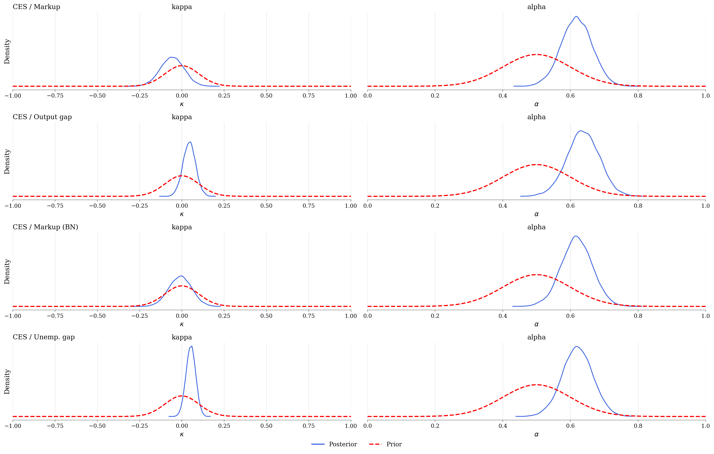
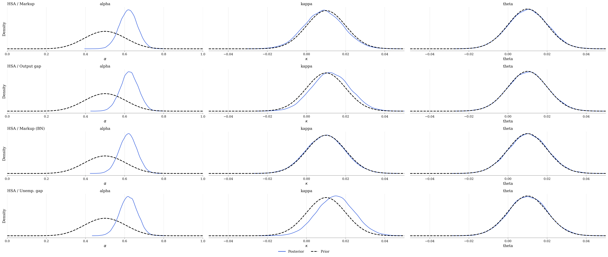
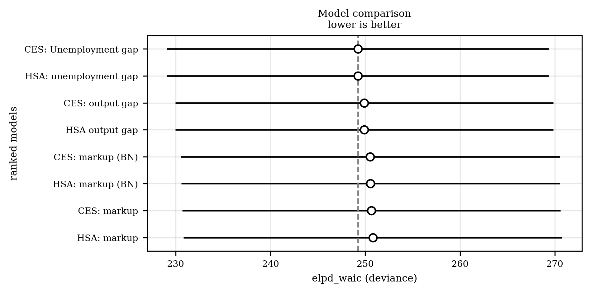
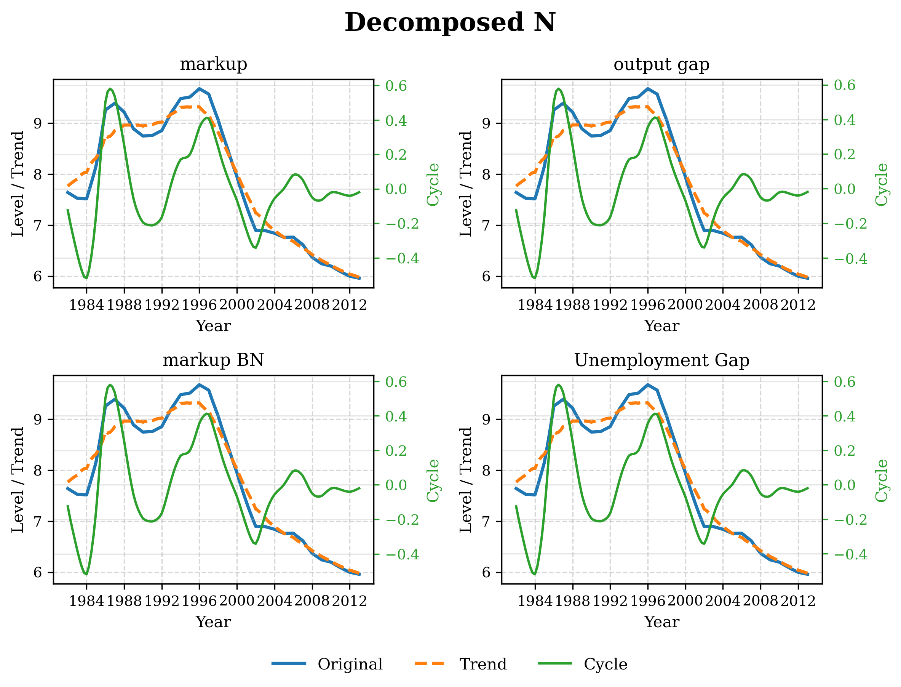

# Hamiltonian Monte Carlo

Evaluate models with
    - Savage-Dickey Density ratio for ($\theta = 0 \text{ or } \theta \neq 0$)
    - WAIC (Watanabe-Akaike Information Criteria)
    （Widely Applicable Information Criterion, Watanabe Akaike Information Criterion）is calculated by:
    $$
    \text{WAIC}=-2\Bigl(\text{lppd}-p_{\text{WAIC}}\Bigr)
    $$
    where
    - log pointwise predictive density
    $$
    \text{lpd}=\sum_{i=1}^{n}\log\Biggl(\frac{1}{S}\sum_{s=1}^{S}p\Bigl(y_{i}\mid\theta^{(s)}\Bigr)\Biggr)
    $$
    This term measures the average fit of the model across all posterior draws. It’s like the average log-likelihood, but averaged over the posterior.
    - effective number of parameters
    $$
    p_{\text{WAIC}}=\sum_{i=1}^{n}Var_{\theta}\Bigl(\log p\bigl(y_{i}\mid\theta\bigr)\Bigr)
    $$
    This captures how much the log-likelihood varies across posterior samples for each data point. High variance means the model is more complex (more sensitive to the choice of parameters), so it penalizes complexity.

# Estimation
### CES (Benchmark)
$$
\pi_{t}=\alpha\pi_{t-1}+(1-\alpha)\mathbb{E}_{t}\pi_{t-1}+\kappa x_{t}+v_{t}
$$
- Priors: 
    - $\alpha \sim N(0.5, 0.1)$  
    - $\kappa \sim N(0, 0.05)$  
    - $\sigma_v \sim InvGamma(0.001, 0.001)$  

#### Posterior vs Prior

### HSA
$$
\pi_{t}=\alpha\pi_{t-1}+(1-\alpha)\mathbb{E}_{t}\pi_{t+1}+\kappa x_{t}-\theta\hat{N}_{t}+v_{t},\\
N_{t}=\bar{N}_{t}+\hat{N}_{t},\\
\text{where}\\
\hat{N}_{t}=\rho_1 \hat{N}_{t-1}+\rho_2 \hat{N}_{t-2}+\epsilon_{t}\\
\bar{N}_{t}=n+\bar{N}_{t-1}+\eta_{t},
$$
- Priors:
    - $\alpha \sim N(0.5, 0.1)$  
    - $\kappa \sim N(0, 0.05)$  
    - $\theta \sim N(0, 0.05)$  
    - $\sigma_v \sim InvGamma(0.001, 0.001)$  

#### Posterior vs Prior

### Estimated coefficients

### Savage-Dickey Density Ratio
- CES ($\kappa$)

- HSA ($\kappa$ & $\theta$)

### WAIC

### Check N Decomposition

